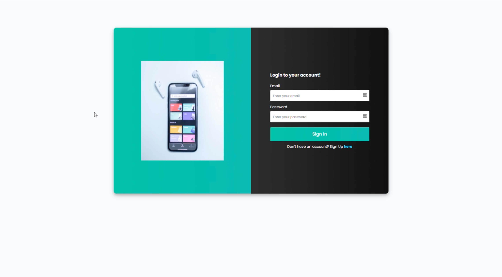
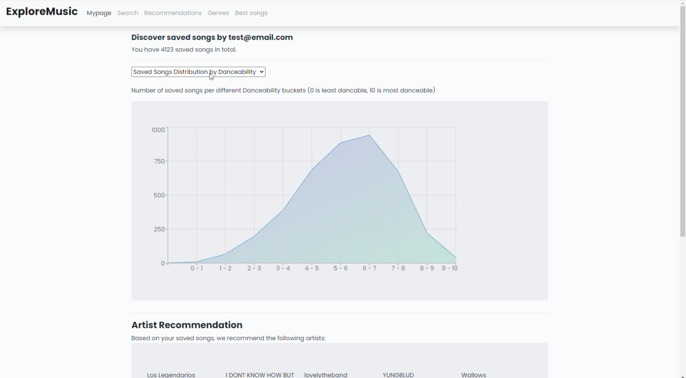
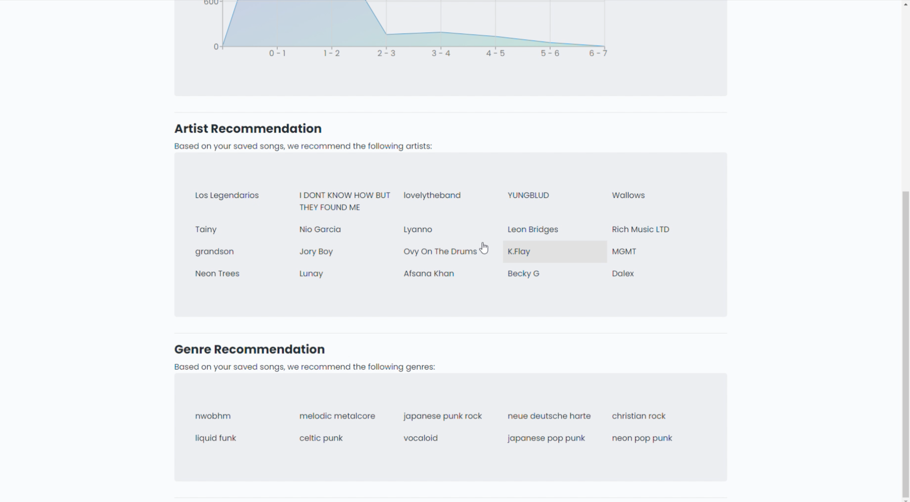
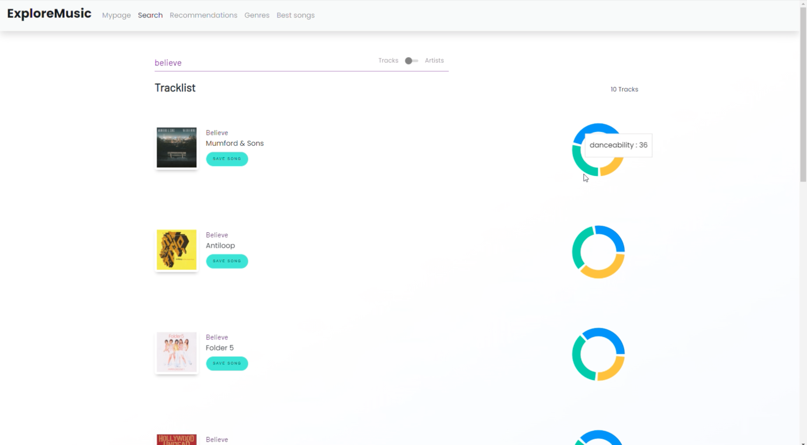
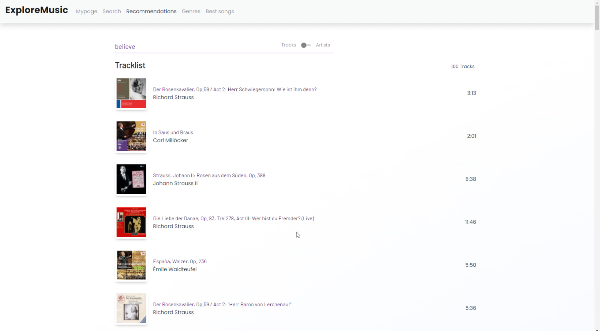
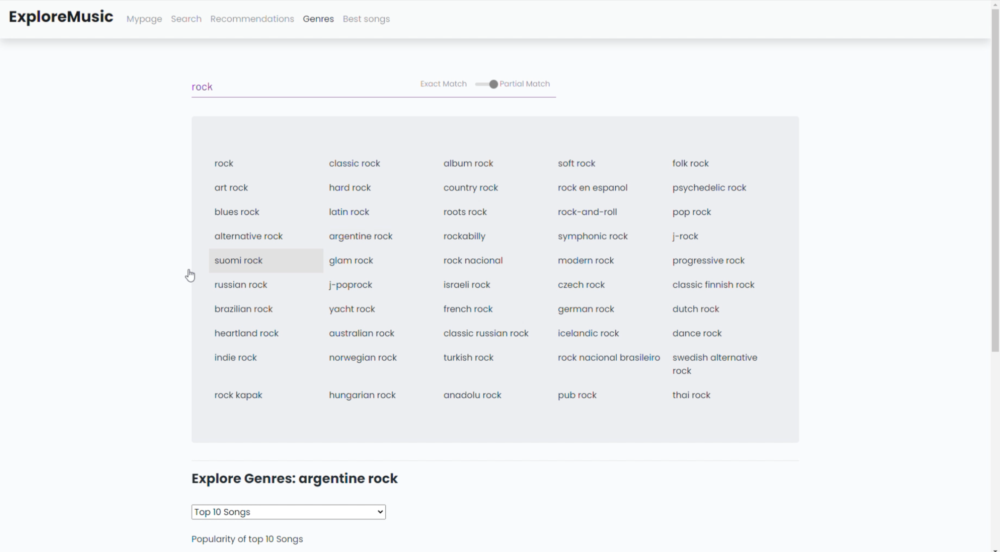
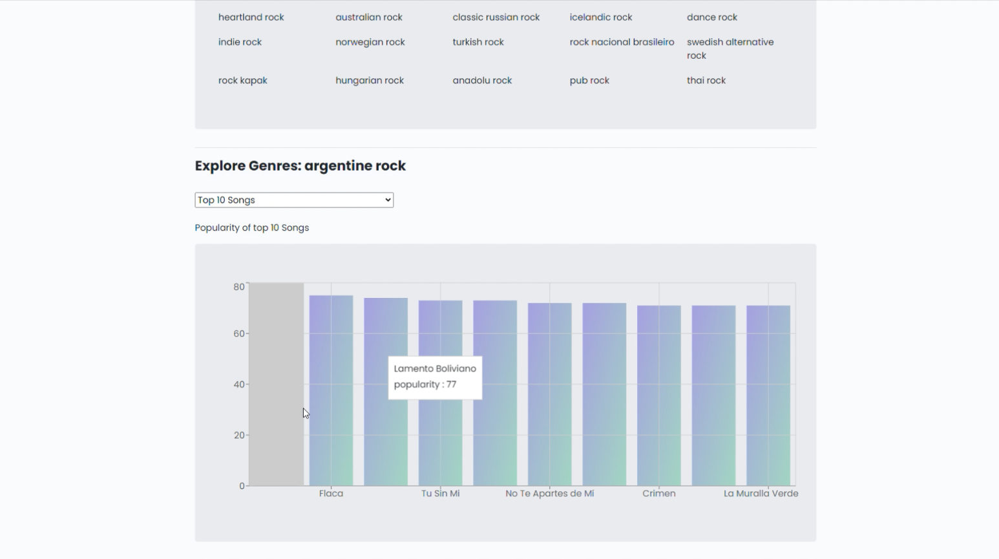

# Recommendify

A platform to explore and discover new songs, artists and genres.
Demo: https://bit.ly/3srSQHv

### Login Tab

### Home Tab

### Search Tab

### Song Recommendations Tab

### Genres Tab

## Instructions to run code:

#### Database:

1. Set up MySQL database
2. Download kaggle dataset for Songs
3. Use the provided webscrapped and NLP tools to generate the Mood values
4. Upload these values into the database
5. Download the kaggle dataset for Artists
6. Upload these values into the database
7. Create a table for users
8. Create a table for the relationships between users, songs, and artists
9. Calculate the Genres tables and the average metrics for genres and artists
10. Create a table for the relationship between artists and genres

#### Server:

1. Update the `db-config.js` file to use the correct database information
2. Run `npm install` in the server directory
3. Run `npm start` in the server directory

#### Client:

1. Make sure that the IP's included are properlly set up for your system, e.g localhost or an EC2
2. Run `npm install` in the client directory
3. Run `npm start` in the client directory
